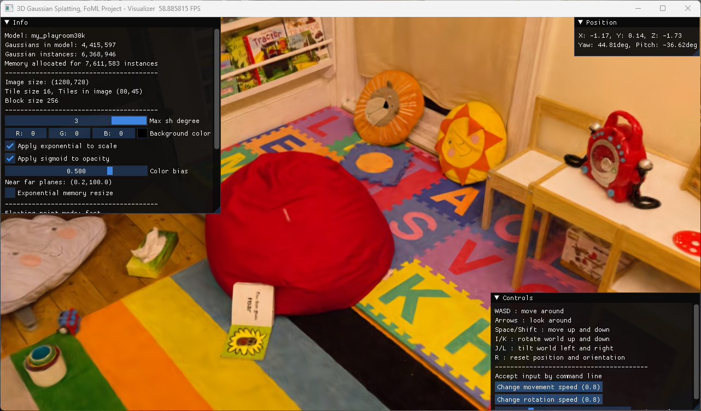
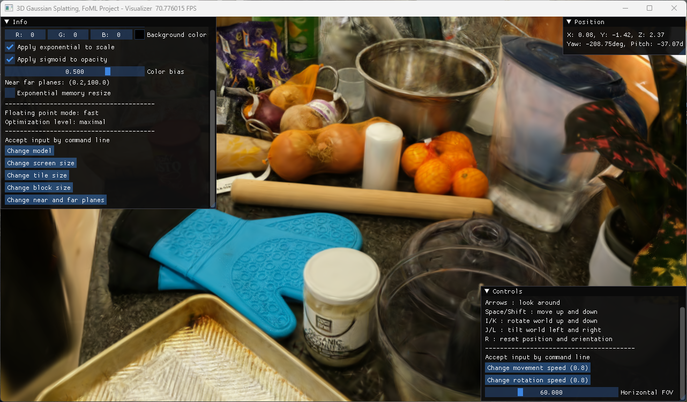
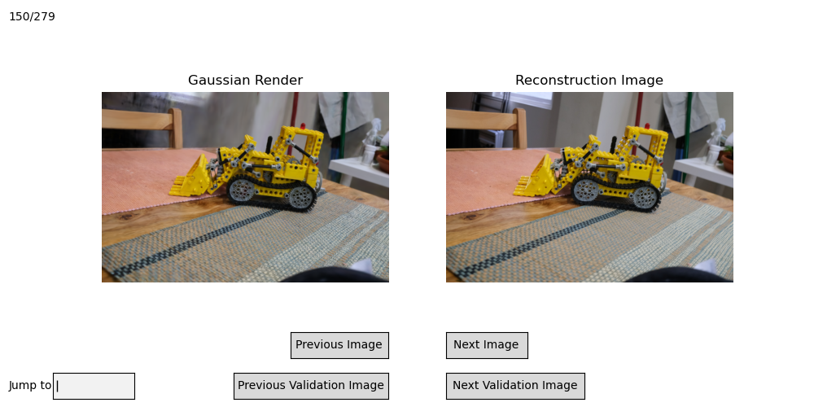
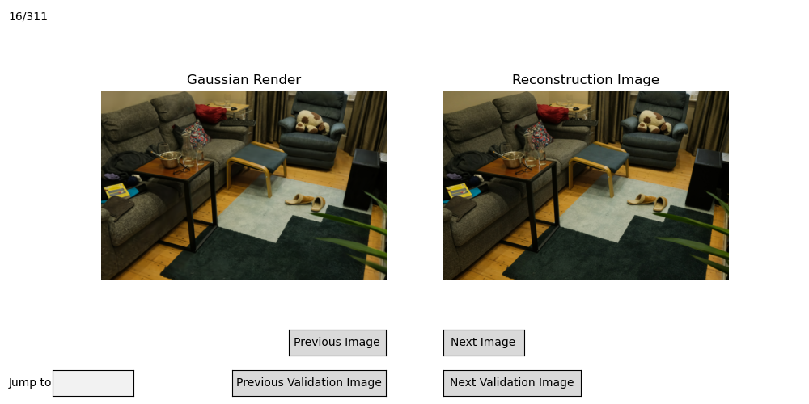

# 3D Gaussian Splatting

Reimplementation of 3D Gaussian Splatting in Python, PyTorch, and SlangPy.\
Made as a project for a university course.

3D Gaussian Splatting is a relatively recent (2023) novel view synthesis technique, representing the scene through 3D Gaussians that are then differentiably rendered to improve the representation through backpropagation.

Contrary to its NeRF (Neural Radiance Fields) counterpart, 3D Gaussian Splatting is notable for its training and rendering speed.

## How to Install

> [!IMPORTANT]\
> This project requires an NVIDIA GPU to run.

1. Clone the project
    ```sh
    git clone https://github.com/Lnrz/3DGaussianSplattingFoML.git
    ```
2. Move the shell to the root directory of the project
3. Create the Conda, or Mamba, environment
    ```sh
    conda env create -f environment.yml
    ```
4. Activate the environment
    ```sh
    conda activate 3dgs
    ```
5. **[Optional]** For better performance, install `slangpy-torch` following these [instructions](https://slangpy.shader-slang.org/en/stable/src/autodiff/pytorch.html#using-the-slangpy-torch-extension)

## How to Use

The project includes 4 scripts inside the `scripts/` directory:
- `train.py`, to train Gaussian models from COLMAP reconstructions
    ```sh
    python scripts/train.py <reconstruction_path>
    ```
- `compare.py`, to compare Gaussian models to COLMAP reconstructions
    ```sh
    python scripts/compare.py <reconstruction_path> <model_path>
    ```
- `validate.py`, to validate Gaussian models against COLMAP reconstructions
    ```sh
    python scripts/validate.py <reconstruction_path>
    ```
- `visualize.py`, to visualize Gaussian models
    ```sh
    python scripts/visualize.py <model_path>
    ```

For more information about their usage and arguments use the `-h` flag

## `splatgs` Module

The Python and Slang implementation of Gaussian Splatting is found in the `src/splatgs/` module.

When rendering, the elements needed are:
- the `Gaussians3D` class to load the Gaussians data
- the `Camera` class to specify the POV
- the `RenderContext` class to hold intermediate data and compiled shaders
- the `render` function 

When training, you will also need:
- the `CalibratedImages` class and `DownsampleCalibratedImages` transform to load and downsample the input data
-  the `AdaptiveDensityControl` class to densify the Gaussians

In `splatgs.slang` there are helper functions for creating the SlangPy device and loading the SlangPy modules needed for shaders compilation.

## Results

### Images

From `visualize.py`




From `comparison.py`




### Metrics

> [!NOTE]
> - the models are initialized from COLMAP point clouds and trained for 30k iterations
> - unlike the paper, the same hyperparameters were not used for all training sessions
> - the models were trained on a RTX3070Ti, the paper models on a A6000

<table>
    <thead>
        <tr>
            <th rowspan="2">Dataset<br>Method|Metrics</th>
            <th colspan="4" style="text-align: center;">Mip-NeRF 360</th>
            <th colspan="4" style="text-align: center;">Tanks&Temples</th>
            <th colspan="4" style="text-align: center;">Deep Blending</th>
        </tr>
        <tr>
            <th>PSNR<sup>↑</sup></th><th>SSIM<sup>↑</sup></th><th>LPIPS<sup>↓</sup></th><th>Train</th>
            <th>PSNR<sup>↑</sup></th><th>SSIM<sup>↑</sup></th><th>LPIPS<sup>↓</sup></th><th>Train</th>
            <th>PSNR<sup>↑</sup></th><th>SSIM<sup>↑</sup></th><th>LPIPS<sup>↓</sup></th><th>Train</th>
        </tr>
    </thead>
    <tbody>
        <tr>
            <td><b>3DGS (from Paper)</b></td>
            <td>27.21</td><td>0.815</td><td>0.214</td><td>41m 33s</td>
            <td>23.14</td><td>0.841</td><td>0.183</td><td>26m 54s</td>
            <td>29.41</td><td>0.903</td><td>0.243</td><td>36m 2s</td>
        </tr>
        <tr>
            <td><b>This Project</b></td>
            <td>24.31</td><td>0.729</td><td>0.256</td><td>41m 51s</td>
            <td>20.29</td><td>0.694</td><td>0.277</td><td>48m 2s</td>
            <td>24.00</td><td>0.744</td><td>0.265</td><td>1h 17m 48s</td>
        </tr>
    </tbody>
</table>

## References

- [3D Gaussian Splatting Paper](https://repo-sam.inria.fr/fungraph/3d-gaussian-splatting/)
- [gsplat Paper](https://arxiv.org/pdf/2409.06765)
